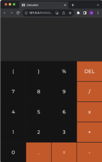

# Calculator
<!--

     

-->
</a>
Welcome to the documentation for the Calculator Repository! This website provides a user-friendly calculator that allows users to perform basic arithmetic operations. The calculator is built using HTML, CSS, and JavaScript, making it easy to use and accessible to anyone with a modern web browser. 

## How to use this calculator
1. **Clone this repository:** Open your terminal and use the `git clone` clone command. After that paste the URL from this repository. Make sure that git is installed on your computer. To check that git is installed use the `git --version` command. If git isn't installed on your computer use homebrew to install git `brew install git`.
2. **Open the cloned repo** with Visual Studio Code. Make sure that you have the **Live Server (Five Server)** extension from Yannick installed.
3. **Run the Code with Five Server**

## Overview of the user interface
### The design

The design of this calculator is both contemporary and sophisticated, rendering it a visually appealing addition to any professional setting. Furthermore, it is equipped with a comprehensive range of essential features that are fundamental to conducting efficient calculations. With this calculator, one can trust that all necessary tools are available to complete tasks with accuracy and expediency.

### Simple but useful functions
The calculator provided offers a comprehensive range of basic and practical functions, enabling users to perform **essential arithmetic operations**, including **addition**, **subtraction**, **multiplication**, and **division**. Additionally, the calculator features advanced capabilities, such as **percentage calculations** and **brackets for more complex equations**. Furthermore, I’m continuously working towards incorporating **new features** to enhance the calculator's functionality.

</a>

## Known Errors/BUGs 🪲
* [**🌟 Feature: Advanced arithmetic operations #3**](https://github.com/N3v1/Calculator/issues/3)

## Other
### Note of Thanks 🙏
* Many thanks to **Phil94comp** for helping me fix bug **#1**. You can find a link to his profile [**here**](https://github.com/Phil94comp).
* Many thanks to **anubhav1206** for redesigning the calculator **#4** and **#6**. You can find a lihk to his profile [**here**](https://github.com/anubhav1206)
